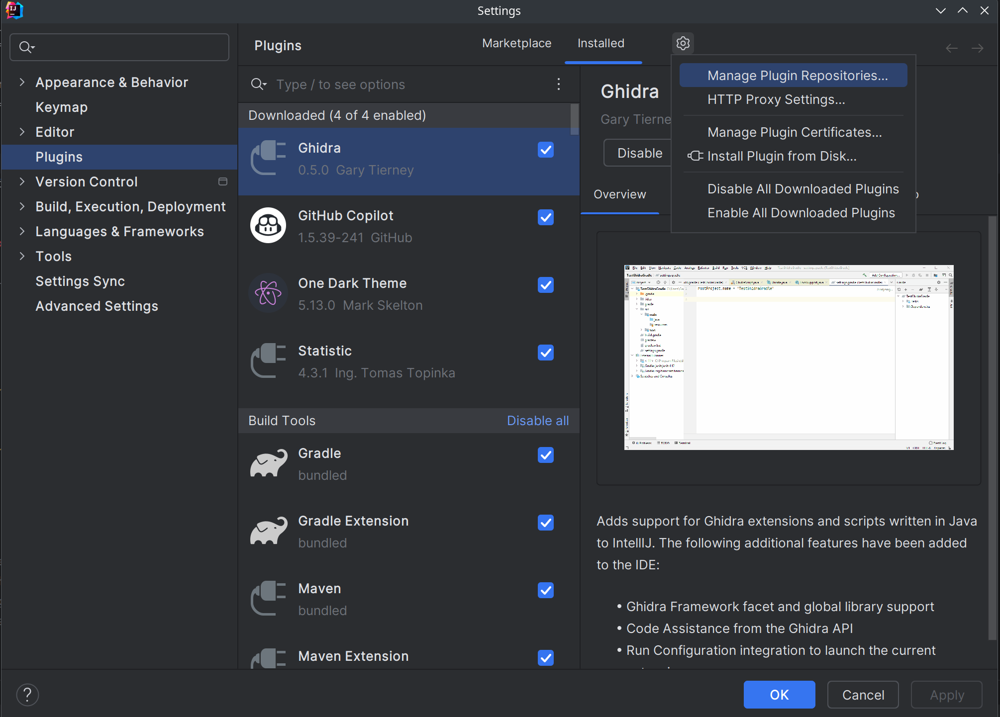
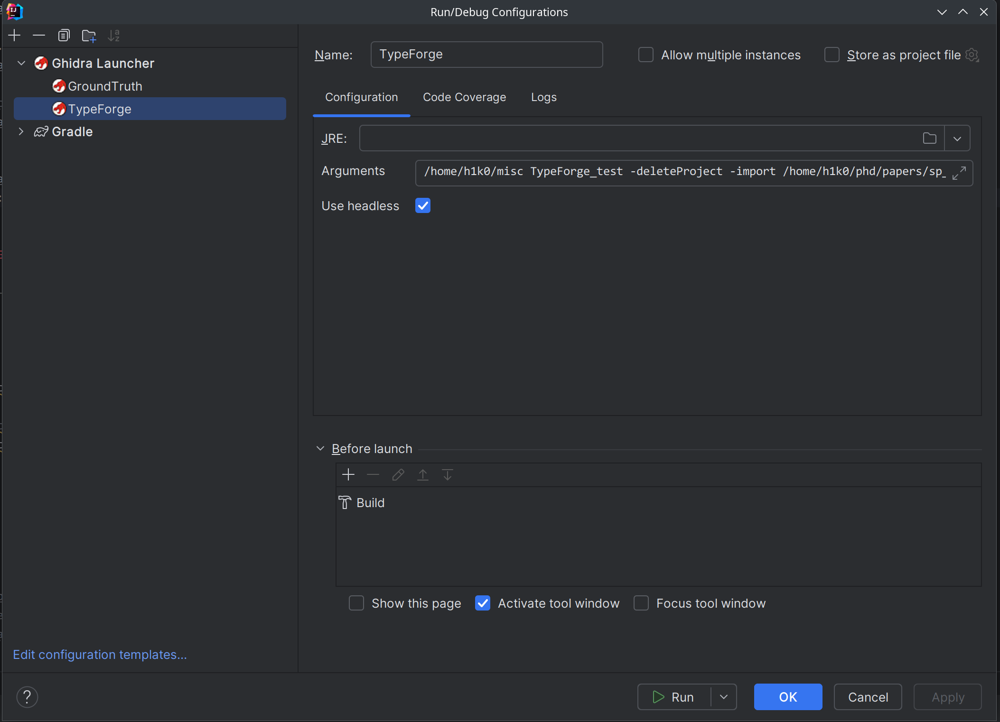
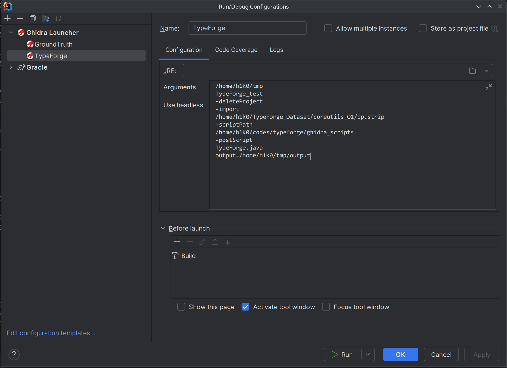
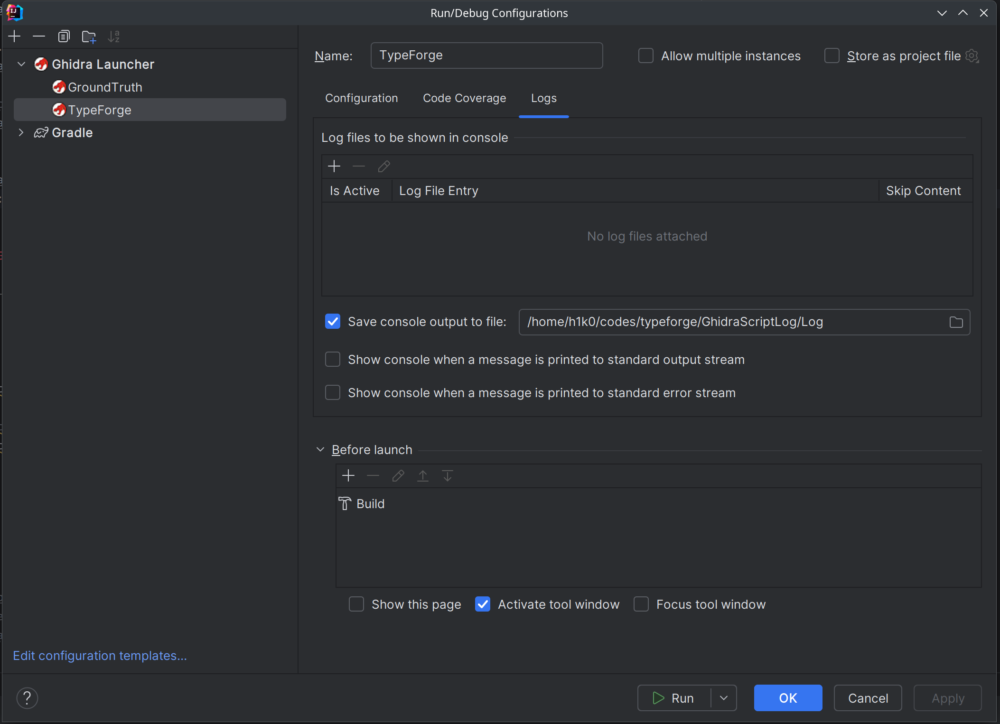

# How to Develop
Writing a simple Ghidra Script is straightforward, but developing a complex Ghidra Extension can be challenging, especially when setting up the initial development environment.  
Ghidra officially supports **Eclipse** for Extension development. However, since **Eclipse** is not very user-friendly, TypeForge uses **IntelliJ IDEA** and **intellij-ghidra** plugin for development.  
(Note: The latest version of Ghidra supports plugin development in **VSCode**, but TypeForge has not been tested in this environment.)

## Setup
1. [intellij-ghidra](https://github.com/garyttierney/intellij-ghidra) is an IDEA plugin that enables developers to work with Ghidra in an integrated environment, providing features such as API completion, compilation, and debugging. Testing has confirmed that IntelliJ IDEA (version **2024.1.7**) can run this plugin properly.
2. A version of intellij-ghidra compatible with IDEA (version 2024.1.7) has been pre-compiled and stored in the [assets](./assets/IntelliJ-Ghidra-0.5.0.zip) directory. Open IDEA, click on `File -> Settings -> Plugins`, and choose to install the plugin (the `.zip` file) from local disk.  

    

3. Follow the [usage guide](https://github.com/garyttierney/intellij-ghidra) for initial plugin configuration.
4. Configure the **TypeForge** project, making sure to check the `headless` option. You can specify a log path to save the plugin's output. The specific parameters are consistent with command-line usage parameters (no need to specify the `analyzeHeadless` path again).

    

    

    
5. Fill in the following arguments for debugging:
   ```text
   <PATH_TO_PROJECT> <PROJECT_NAME> --deleteProject 
   --import <PATH_TO_BINARY> -scriptPath <PATH_TO_GHIDRA_SCRIPT_DIR>
   -postScript TypeForge.java output=<OUTPUT_DIR>
   ```