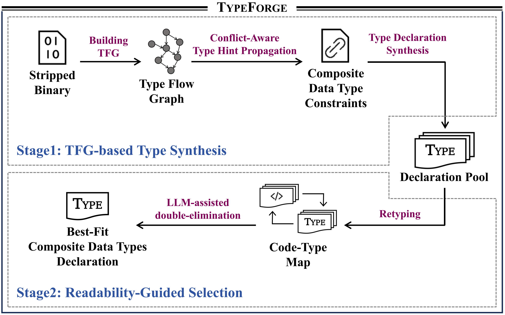

# TypeForge: Synthesizing and Selecting Best-Fit Composite Data Types for Stripped Binaries

[](https://doi.ieeecomputersociety.org/10.1109/SP61157.2025.00193)
[](https://www.ccf.org.cn/Academic_Evaluation/)  
[](./LICENSE)
[](https://github.com/noobone123/typeforge/stargazers)
[](https://github.com/noobone123/typeforge)

> We are continuously maintaining and updating this project, aiming to provide more user-friendly features and higher efficiency.

## Recent Updates

**Latest Version - [06/21/2025]:**
- **Bug Fixes**: Fixed a bug in determining whether the TypeConstraint is empty.
- **Accuracy Improvements**: Enhanced type inference precision, particularly for composite data type identification.
---

This is the implementation of the paper titled "TypeForge: Synthesizing and Selecting Best-Fit Composite Data Types for Stripped Binaries". For more details about TypeForge, please refer to [our S&P 2025 paper](https://www.computer.org/csdl/proceedings-article/sp/2025/223600c847/26hiVajYJwY).

## What is TypeForge?
<div style="float: right; margin: 0 0 10px 20px;">
    
</div>

TypeForge aims to recover composite data types (such as structures, unions, etc.) in stripped binaries. Compared to existing methods, TypeForge provides higher efficiency and accuracy. 
- TypeForge is divided into **two phases**: a *Program Analysis phase* and an *LLM-assisted Refinement phase*. The first phase is sufficient for common reverse engineering tasks, while the second phase further improves the accuracy of phase one results.
- TypeForge is currently implemented as a [Ghidra Extension](https://ghidra-sre.org/InstallationGuide.html#GhidraExtensionNotes). We welcome other developers to port it to platforms like [IDA Pro](https://hex-rays.com/ida-pro), [Binary Ninja](https://binary.ninja/), and [Angr](https://github.com/angr/angr).


## Project Structure

```
typeforge/                             # Project root
├── ...
├── build.gradle                       # Gradle build configuration
├── extension.properties               # Extension properties
├── src/                               # Main Source code of TypeForge
│   ├── main/java/typeforge            
│   │   ├── analyzer/                  # Entry functions for various program analyses
│   │   ├── base/                      # Underlying components for program analysis algorithms
│   │   │   ├── dataflow/              # Data flow analysis (including data flow abstractions, intra/inter-procedural Solvers)
│   │   │   ├── graph/                 # CallGraph
│   │   │   ├── node/                  # Binary functions and CallSites
│   │   │   ├── parallel/              # Parallel processing Callbacks
│   │   │   └── passes/                # Passes used for synthesizing possible type declarations
│   │   └── utils/                     # Other useful functions for binary analysis
│   └── test/
├── ghidra_scripts/                    # Ghidra scripts
│   ├── TypeForge.java                 # Main TypeForge script
│   └── GroundTruth.java               # Ground truth extractor (from binaries with debug symbol)
├── scripts/                           # Useful Python Scripts
│   ├── judge/                         # LLM-assisted double elimination process
│   ├── GraphExplorer.py               # (Debugging purpose) Explore dumped Type Flow Graph
│   ├── GroundTruthExtractor.py        # Ground truth extractor (wrapper, actually call GroundTruth.java)
│   └── TypeInference.py               # Type Inference (wrapper, actually call TypeForge.java)
├── lib/
└── ...
```

## Building and Installing
### Building as ghidra extension
1. clone this repo

    ```bash
    git clone https://github.com/noobone123/TypeForge.git
    ```
2. Install JDK and Ghidra (ghidra version 11.0.3 is tested).   
download ghidra from [here](https://github.com/NationalSecurityAgency/ghidra/releases/download/Ghidra_11.0.3_build/ghidra_11.0.3_PUBLIC_20240410.zip) and following the ghidra [install instructions](https://github.com/NationalSecurityAgency/ghidra/blob/Ghidra_11.0.3_build/GhidraDocs/InstallationGuide.html).
3. Modify `ghidraInstallDir` to **YOUR Ghidra installation directory** in the `build.gradle`.
4. build the ghidra extension.

    ```bash
    cd TypeForge
    gradle buildExtension
    # after building, you will find your extension zip file.
    ls -alh ./dist/ghidra_11.0.3_PUBLIC_[your-build-time]_TypeForge.zip
    ```

### Installing
Please refer to the following command to unzip and install the compiled Ghidra Extension.

```bash
cp ./dist/ghidra_11.0.3_PUBLIC_[your-build-time]_TypeForge.zip \
    [YOUR-Ghidra-Installation-Directory]/Ghidra/Extensions
cd [YOUR-Ghidra-Installation-Directory]/Ghidra/Extensions
unzip ghidra_11.0.3_PUBLIC_[your-build-time]_TypeForge.zip
```

## Getting Started
### Type Inference (Headless Mode)

After installing the TypeForge, for a single stripped binary, just run:
```bash
[YOUR-Ghidra-Installation-Directory]/support/analyzeHeadless \
    [YOUR-Ghidra-Project-Directory] [YOUR-Project-Name] \
    -deleteProject -import [YOUR-Stripped-Binary] \
    -postScript TypeForge.java output=[Your-output-dir]
```

After a while, you will see the Type Inference results (JSON files) saved in `[Your-output-dir]`. For details about these JSON files, please refer to the [demo](./demo/README.md). These JSON files will then be fed into *Phase 2 for refinement*. For more information, please refer to [judge](./scripts/judge/README.md).

For **batch processing**, please refer to [scripts](./scripts/README.md).

> We are currently developing additional features to directly import Type Inference results into Ghidra projects.

> For more information about Ghidra Headless Mode, please refer to [this guide](https://static.grumpycoder.net/pixel/support/analyzeHeadlessREADME.html).

### Extract the Ground Truth
You can also extract the ground truth of composite data types from a binary with debug information (Note that Ghidra currently does **NOT** support Dwarf-5 format debug information, so you need to specify `-gdwarf-4` during compilation).
For more details, please refer to [scripts](./scripts/README.md).

### Run in Ghidra GUI Mode
In development ...

## Developing and Debugging
TypeForge is developed using [IntelliJ IDEA](https://www.jetbrains.com/idea/download/other.html) (version 2024.1.7) and the [intellij-ghidra](https://github.com/garyttierney/intellij-ghidra) plugin. For detailed development guidelines, please refer to [How To Develop](./DEVELOPING.md).

## Contributors
TypeForge is written and maintained by:
- [h1k0](https://github.com/noobone123) h1k0naka@outlook.com
- [liyilin](https://github.com/li-yilin-30) liyilin2023@iie.ac.cn

## Cite

If you use `TypeForge` for your academic work, please cite the following paper:
```
@inproceedings{typeforge,
  title      = {TypeForge: Synthesizing and Selecting Best-Fit Composite Data Types for Stripped Binaries},
  author     = {Wang, Yanzhong and Liang, Ruigang and Li, Yilin and Hu, Peiwei and Chen, Kai and Zhang, Bolun},
  booktitle  = {2025 IEEE Symposium on Security and Privacy (SP)},
  pages      = {2847--2864},
  year       = {2025},
  publisher  = {IEEE Computer Society},
  doi        = {10.1109/SP61157.2025.00193},
}
```